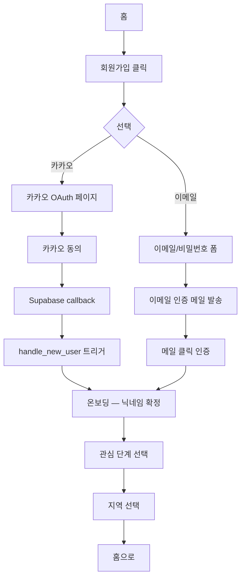
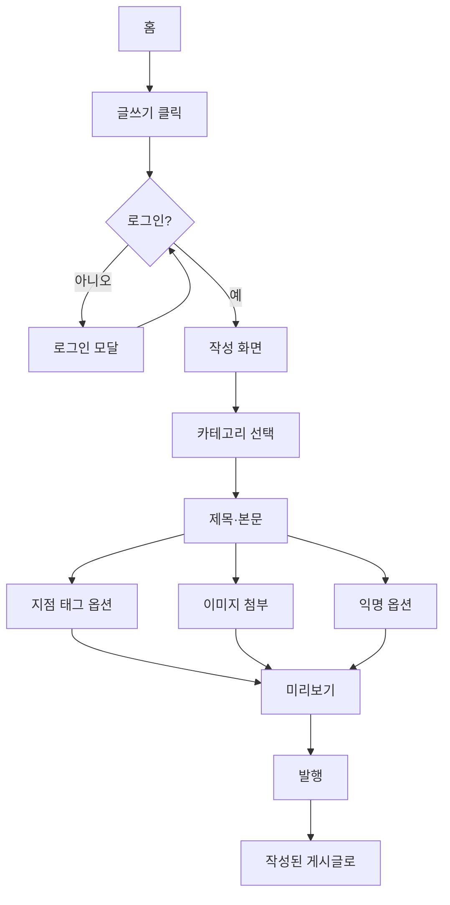
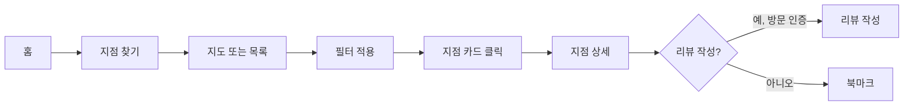
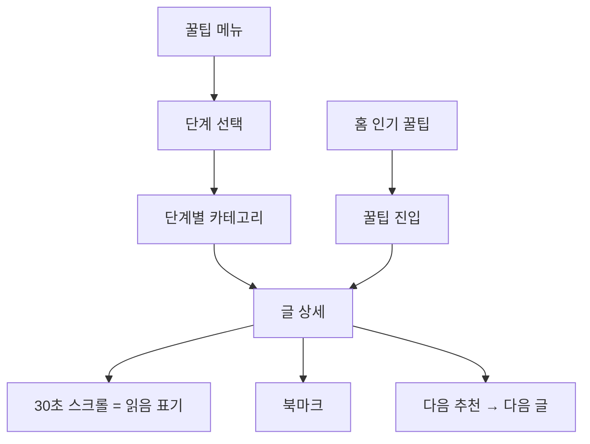

# Phase 0 — IA·UX·디자인 톤 (자이 작성)

> 대한민국 실내 클라이밍 포털의 정보 구조, 핵심 화면 와이어프레임, 디자인 톤·토큰 초안.
> 데스크탑(1280+) + 모바일(360+) 1급 지원. 톤: 캐주얼 + 운동 감성.

---

## 1. 사이트맵

```
/                          홈 (피드 + 인기 꿀팁 + 근처 짐)
├─ /community             커뮤니티
│  ├─ /community/[cat]      카테고리별 (자유/질문/장비/루트공유/지점별)
│  ├─ /community/post/[id]  게시글 상세
│  ├─ /community/write      글 작성
│  └─ /community/search     검색
├─ /gyms                  클라이밍장
│  ├─ /gyms/map             지도 뷰
│  ├─ /gyms/list            목록 뷰
│  ├─ /gyms/[slug]          지점 상세
│  ├─ /gyms/[slug]/reviews  리뷰
│  └─ /gyms/submit          사용자 제보 (로그인 필요)
├─ /tips                  꿀팁 (큐레이션)
│  ├─ /tips/levels/[level]  단계별 (입문/초급/중급/상급/엘리트)
│  ├─ /tips/category/[cat]  카테고리별
│  ├─ /tips/[slug]          글 상세
│  └─ /tips/bookmarks       내 북마크 (로그인 필요)
├─ /me                    마이페이지 (로그인 필요)
│  ├─ /me/profile           프로필 편집
│  ├─ /me/posts             내 게시글
│  ├─ /me/comments          내 댓글
│  ├─ /me/bookmarks         북마크 모음
│  ├─ /me/activity          활동 로그·레벨
│  └─ /me/settings          알림·계정 설정
├─ /auth
│  ├─ /auth/login           로그인
│  ├─ /auth/signup          회원가입
│  ├─ /auth/callback        OAuth 콜백
│  └─ /auth/reset           비밀번호 재설정
├─ /admin                 관리자 (role=admin/moderator)
│  ├─ /admin/dashboard      대시보드
│  ├─ /admin/users          사용자 관리
│  ├─ /admin/posts          게시글 관리
│  ├─ /admin/reports        신고 처리
│  ├─ /admin/gyms           클라이밍장 편집
│  ├─ /admin/tips           꿀팁 발행 큐
│  └─ /admin/audit          감사 로그
└─ /static
   ├─ /terms                이용약관
   ├─ /privacy              개인정보처리방침
   ├─ /disclaimer           면책 고지
   └─ /contact              문의
```

---

## 2. 정보 구조 (IA)

### 2.1 글로벌 네비게이션

**헤더 (데스크탑)**:
```
[로고 ClimbForum]  [홈] [커뮤니티 ▾] [클라이밍장 ▾] [꿀팁 ▾]    [🔍 검색]  [🔔]  [프로필 아바타 ▾]
```

**헤더 (모바일)**: 햄버거 메뉴 + 로고 + 검색 + 알림 + 프로필
**풋터**: 이용약관·개인정보·면책·문의·운영자 정보 + 카피라이트

### 2.2 카테고리·태그 분류

**커뮤니티 카테고리** (8개):
- 자유게시판 (디시 톤 허용)
- 질문/답변
- 장비
- 루트·문제 공유
- 지점별 (지역 필터)
- 야외 등반
- 대회·이벤트
- 후기

**꿀팁 카테고리**: tips-content-plan.md의 12개 카테고리 사용

**태그**: 사용자 자유 입력 (top-N 태그 자동완성), 지점명 태그는 시스템 관리

### 2.3 검색·필터

- 글로벌 검색 (`/`키 단축): 게시글 + 꿀팁 + 클라이밍장 통합
- 클라이밍장 필터: 지역(시/도), 시설(리드/볼더/스피드), 영업 시간, 시설·편의 옵션
- 게시판 필터: 카테고리, 작성 기간, 정렬(최신/추천순/댓글순), 태그
- 꿀팁 필터: 단계, 카테고리

### 2.4 다국어
- 한국어 단일, UI 라벨에 영어 보조 (예: "꿀팁 (Tips)") 일부만
- 사용자 콘텐츠 번역 안 함

---

## 3. 핵심 화면 와이어프레임

### 3.1 홈 (데스크탑)

```
+---------------------------------------------------------------+
| [Logo]  홈 커뮤니티▾ 클라이밍장▾ 꿀팁▾    🔍  🔔  [아바타] ▾  |
+---------------------------------------------------------------+
|                                                                |
| [HERO]                                                         |
| 큰 사진 placeholder — 클라이밍 손 잡는 16:9 (어두운 톤)         |
| {/* TODO(codex): hero — 검정 배경 위 야광 홀드, 캐주얼+힘 */}    |
| 카피: "오늘 어디서 등반할까요?"  [지점 찾기 →]                  |
|                                                                |
+---------------------------------------------------------------+
|  [좌] 최신 피드 (커뮤니티)         |  [우] 사이드바            |
|  ┌────────────────────────────┐    |  ┌─────────────────────┐ |
|  │ [카테고리 칩] 자유 질문 장비 │    |  │ 인기 꿀팁           │ |
|  │ ─────────────────────────  │    |  │ • 처음 가는 사람…    │ |
|  │ ◯ 작성자 · 2시간 전        │    |  │ • 풋워크 가이드      │ |
|  │   "오늘 더클라임 강남…"     │    |  │ • 행보드 시작        │ |
|  │   👍 24  💬 8              │    |  │ [더 보기 →]          │ |
|  │ ─────────────────────────  │    |  └─────────────────────┘ |
|  │ ◯ 작성자 · 4시간 전        │    |  ┌─────────────────────┐ |
|  │   "신발 추천 부탁드려요"    │    |  │ 근처 클라이밍장      │ |
|  │   👍 7   💬 12             │    |  │ 위치 기반 (또는 서울)│ |
|  │ ─────────────────────────  │    |  │ • 더클라임 강남      │ |
|  │ ...                        │    |  │ • 어센드 홍대        │ |
|  │ [더 보기 ↓]                │    |  │ [지도 보기 →]        │ |
|  └────────────────────────────┘    |  └─────────────────────┘ |
+---------------------------------------------------------------+
| 푸터: 약관·개인정보·면책·운영정보·카피라이트                  |
+---------------------------------------------------------------+
```

### 3.2 홈 (모바일 360+)

```
+-----------------+
| ☰  Logo   🔍 🔔 |
+-----------------+
| [HERO placeholder]
| "오늘 어디서 등반할까요?"
| [지점 찾기 →]
+-----------------+
| 인기 꿀팁
| ▸ 처음 가는 사람…
| ▸ 풋워크 가이드
| [더 보기]
+-----------------+
| 카테고리 칩 (가로 스크롤)
| [자유][질문][장비][...]
+-----------------+
| 피드 카드
| ◯ 작성자 · 2시간
|  "오늘 더클라임 강남…"
|  👍 24 💬 8
| ─────────────
| ◯ 작성자 · 4시간
|  ...
+-----------------+
| 하단 탭바
| [🏠][🗺][💬][💡][👤]
+-----------------+
```

### 3.3 클라이밍장 지도+목록 (데스크탑 분할 뷰)

```
+---------------------------------------------------------------+
| 헤더                                                           |
+---------------------------------------------------------------+
| 필터: [지역▾] [시설▾] [영업중] [정렬: 거리▾]   [목록] [지도]  |
+---------------------------------------------------------------+
| [좌 패널: 목록 30%]                | [우 패널: 지도 70%]      |
|                                      |                          |
| ┌──────────────────────────┐         | [카카오 지도 SDK]        |
| │ 1. 더클라임 강남점        │   ←hover│                          |
| │   서울 강남 / ★4.7 / 24h │  → 지도 │   📍 📍                  |
| │   사진 placeholder        │  마커  │      📍                   |
| │   [편의 칩: 매트, 시즌권] │  강조  │   📍                       |
| ├──────────────────────────┤         |       📍 📍               |
| │ 2. 어센드 홍대 ...        │         |                          |
| ├──────────────────────────┤         |  [+ - 줌] [📍 내 위치]   |
| │ 3. 락트리 잠실 ...        │         |                          |
| └──────────────────────────┘         |                          |
| [페이지네이션]                       |                          |
+---------------------------------------------------------------+
```

### 3.3 모바일 — 지도/목록 토글 탭

```
+-----------------+
| ← 클라이밍장     |
| [목록] [지도]    | ← 토글
+-----------------+
| 필터 칩 가로 스크롤
+-----------------+
| 1. 더클라임 강남
|   ★4.7 / 24h
|   사진 thumb
|   [편의 칩]
| ─────────────
| 2. 어센드 홍대
| ...
+-----------------+
```

### 3.4 클라이밍장 상세

```
+---------------------------------------------------------------+
| 헤더                                                           |
+---------------------------------------------------------------+
| [HERO 사진 placeholder 16:9]                                  |
| {/* TODO(codex): 지점 사진 — 운영자 제공 또는 placeholder */} |
+---------------------------------------------------------------+
| 더클라임 강남점                            [★ 북마크] [공유]   |
| 서울 강남구 ○○로 12, 3F · 02-XXX-XXXX                          |
| ────────────────────────────────────────                       |
| [현재 영업 중] · 영업시간 보기 ▾                                |
+---------------------------------------------------------------+
| [좌 60%]                          | [우 40%]                   |
|                                   |                            |
| 시설 칩                            | [미니 지도]                |
| 볼더 / 리드 / 시스템보드           |  📍                        |
|                                   |  주소 복사 [📋]            |
| 난이도 분포                        |  카카오맵에서 보기 →       |
| V0-V11 (지점 자체 색깔: ●●●●●●●)   |                            |
|                                   | 가격                        |
| 가격                               | 1일 18,000원                |
| (상세 표)                          | 시즌권 다양 → 보기          |
|                                   |                            |
| 편의 시설                          | 인스타 (외부 링크)          |
| 🚿 샤워실  🚲 자전거  🅿️ 주차       | @theclimb_gangnam ↗        |
|                                   |                            |
| 사진 갤러리 placeholder            |                            |
| [□][□][□][□]                       |                            |
+---------------------------------------------------------------+
| 리뷰 (24)                                                      |
| ─────────────────────────────                                   |
| ◯ 사용자A · ★★★★★ · 2026.05.01                                  |
| "강사진 친절하고 매트 두꺼움…"                                  |
| 👍 5  💬 2                                                      |
| ─────────────────────────────                                   |
| [리뷰 작성]                                                     |
+---------------------------------------------------------------+
| 이 지점 태그된 커뮤니티 글 (5)                                  |
| ▸ 강남점 야간 혼잡도 후기                                       |
| ▸ ...                                                          |
+---------------------------------------------------------------+
```

### 3.5 커뮤니티 게시판 목록 (디시 톤)

```
+---------------------------------------------------------------+
| 자유게시판  ←카테고리 탭                                       |
| [전체] [자유] [질문] [장비] [루트] [지점별] [야외] [대회] [후기] |
+---------------------------------------------------------------+
| 정렬: [최신▾] [추천] [댓글많은]    검색: [_______] [글쓰기]     |
+---------------------------------------------------------------+
| 번호 | 제목                                        | 글쓴이 | 시간   | 👍 | 💬 |
| ── ─ ────────────────────────────────────────── ──────────── ───── ─── ── ─ |
| 124  | [후기] 어제 더클라임 강남 다녀온 일지 ㅋㅋ      | 매달이형 | 2시간  | 24 | 8  |
| 123  | [짤방] 보라색 도전 99회차 짤 만들었다             | ㅇㅇ    | 3시간  | 17 | 14 |
| 122  | [질문] V4 막혀서 죽겠어요 어떻게 하셨음           | 클라뽕이 | 4시간  | 5  | 22 |
| 121  | [장비] 신발 추천좀  솔직히                       | ㄴㄴ    | 5시간  | 3  | 19 |
| 120  | [공지] 욕설·혐오·도용은 즉시 차단됩니다             | 운영자  | -      | -  | -  |
| ...  |                                              |        |       |    |    |
+---------------------------------------------------------------+
| [페이지네이션]  1 2 3 4 5 …                                   |
+---------------------------------------------------------------+
```

디시 톤 표현 요소:
- 닉네임에 ㅇㅇ, ㄴㄴ 등 익명 허용 (반익명 옵션)
- 제목에 [후기][짤방][질문] 같은 말머리 자유롭게
- 본문에 짤(이미지) 첨부 자유
- 그러나 욕설·혐오·도용은 운영 룰로 즉시 차단 (디시처럼 무법 X)

### 3.5.1 게시글 상세

```
+---------------------------------------------------------------+
| ← 자유게시판                                                   |
+---------------------------------------------------------------+
| [후기] 어제 더클라임 강남 다녀온 일지 ㅋㅋ                       |
| 매달이형 · 2026.05.21 14:23 · 조회 234 · [지점: 더클라임 강남]   |
+---------------------------------------------------------------+
| 본문...                                                        |
| (마크다운 렌더 + 사진 첨부)                                    |
+---------------------------------------------------------------+
| [👍 24]  [👎 1]  [⭐ 북마크]  [⚠️ 신고]  [공유]                  |
+---------------------------------------------------------------+
| 댓글 (8)            [추천순 ▾] [최신순]                         |
| ─────────────────────────────────                              |
| ◯ 클라뽕이 · 2시간                                              |
|   ㄹㅇ 강남점 매트 두껍긴 함                                    |
|   👍 5 💬 답글 1                                                |
|   ─ ◯ 매달이형 · 1시간                                          |
|       ㅇㅇ 무릎 박살나도 안 아픔                                |
|       👍 2                                                      |
| ─────────────────────────────────                              |
| [댓글 작성 박스]                                                |
+---------------------------------------------------------------+
```

### 3.6 꿀팁 단계 진입 카드 (라이트 톤)

```
+---------------------------------------------------------------+
| 꿀팁 (Tips)                                                    |
+---------------------------------------------------------------+
| 어디서 시작할까요? 본인 레벨을 골라주세요.                      |
|                                                                |
| ┌─────────────┐ ┌─────────────┐ ┌─────────────┐                |
| │  입문        │ │  초급        │ │  중급        │                |
| │  [🌱 icon]   │ │  [🌿 icon]   │ │  [🌳 icon]   │                |
| │  처음 가는   │ │  V0-V3 정도  │ │  V4-V6 정도  │                |
| │  분들        │ │              │ │              │                |
| │  글 5편      │ │  글 4편      │ │  글 3편      │                |
| └─────────────┘ └─────────────┘ └─────────────┘                |
| ┌─────────────┐ ┌─────────────┐                                |
| │  상급        │ │  엘리트       │                                |
| │  [🏔 icon]   │ │  [⛰ icon]    │                                |
| │  V7-V9       │ │  V10+         │                                |
| │  글 2편      │ │  글 1편       │                                |
| └─────────────┘ └─────────────┘                                |
|                                                                |
| 또는 카테고리로 보기                                           |
| [기본기] [무브먼트] [부상예방] [트레이닝] [멘탈] [장비] [야외] |
| [대회] [어린이] [한국환경] [흔한오해] [컨디셔닝]               |
+---------------------------------------------------------------+
```

### 3.6.1 꿀팁 상세

```
+---------------------------------------------------------------+
| ← 꿀팁 / 입문 / 기본기                                          |
+---------------------------------------------------------------+
| 처음 등반장에 가기 전 30분 — 입문자가 알아야 할 7가지            |
| [입문] [기본기] · 큐레이터: 시커 · 2026.05.20 · 7분 분량         |
+---------------------------------------------------------------+
| [⭐ 북마크]  [📋 목차]  [🔗 공유]                               |
+---------------------------------------------------------------+
| ⚠️ 면책: 본 글은 일반 정보 제공 목적입니다... (D.2 짧은 버전)     |
+---------------------------------------------------------------+
| HERO 이미지 placeholder (16:9)                                  |
| {/* TODO(codex): 입문자가 짐 입구에 서있는 모습 */}              |
+---------------------------------------------------------------+
| 본문 (목차 사이드바 좌측 sticky)                               |
| 1. 예약 필요한가요?                                            |
| 2. 무엇을 입고 갈까요?                                         |
| 3. 신발은 빌릴까 살까?                                         |
| ... (마크다운 렌더, 코드블록 없음, 사진은 placeholder)          |
+---------------------------------------------------------------+
| 출처                                                            |
| - climbing.com — "Beginner's Guide to Indoor Climbing"          |
| - latticetraining.com — "First Visit to a Climbing Gym"         |
| - YouTube Hooper's Beta — "Beginner Indoor Climbing Tips"       |
+---------------------------------------------------------------+
| 다음 추천: ▸ 정확한 풋워크 / ▸ 처음 사는 클라이밍 슈즈           |
+---------------------------------------------------------------+
| 댓글 (12) — 사실 관련 토론만, 잡담은 커뮤니티로                  |
| (꿀팁 댓글은 추천/비추 없음, 단순 토론 + 신고만)                |
+---------------------------------------------------------------+
```

### 3.7 관리자 대시보드

```
+---------------------------------------------------------------+
| [관리자] 대시보드   사용자  게시글  신고  클라이밍장  꿀팁  감사  |
+---------------------------------------------------------------+
| 오늘 지표                                                       |
| ┌─────┐ ┌─────┐ ┌─────┐ ┌─────┐                                |
| │신규 │ │게시 │ │신고 │ │오류 │                                |
| │ 24  │ │ 87  │ │  3  │ │  1  │                                |
| └─────┘ └─────┘ └─────┘ └─────┘                                |
+---------------------------------------------------------------+
| 처리 대기                                                       |
| 신고 3건 [모두 처리 →]                                          |
| 꿀팁 발행 대기 2건 [리뷰 →]                                     |
| 사용자 제보 클라이밍장 4건 [승인 →]                              |
+---------------------------------------------------------------+
| 최근 감사 로그 (audit_log)                                      |
| ◯ moderator_A · 게시글 #122 숨김 · 5분 전                       |
| ◯ admin_B · 사용자 #345 7일 정지 · 1시간 전                     |
+---------------------------------------------------------------+
```

---

## 4. 디자인 톤 / 무드보드

### 4.1 핵심 컨셉

- **두 톤 공존**: 커뮤니티는 거칠고 캐주얼, 꿀팁은 깔끔하고 신뢰감.
- **운동 감성**: 클라이밍 홀드의 채도 높은 원색, 분필가루의 회백색, 매트의 검정.
- **다크모드 우선**: 어두운 짐 환경 + 야간 등반 분위기 반영. 라이트 모드 보조 지원.

### 4.2 컬러 팔레트

```
[베이스]
- bg/primary     #0E0E10  (거의 검정, 약간의 따스함)
- bg/secondary   #18181B
- bg/elevated    #232326

[텍스트]
- text/primary   #F5F5F7
- text/secondary #A1A1AA
- text/disabled  #52525B

[액센트 (홀드 컬러)]
- accent/orange  #FF7A1A  (메인 — 도전, 에너지)
- accent/cyan    #18D7FF  (꿀팁 강조 — 차분한 신뢰)
- accent/lime    #C4FF3D  (성공·완등 — 발랄)
- accent/magenta #FF3DA0  (커뮤니티 강조)

[상태]
- success        #22C55E
- warning        #F59E0B
- danger         #EF4444
- info           #3B82F6
```

라이트 모드는 위 베이스를 반전 (#FFFFFF / #F5F5F7 / #E4E4E7).

### 4.3 타이포그래피

- **헤드라인 폰트**: Pretendard Variable (한글 가독성·운동감 모두 강한 산세리프)
- **본문 폰트**: Pretendard Variable (단일 폰트 정책)
- **숫자·코드**: JetBrains Mono (admin 페이지·코드블록)
- **대체**: Wanted Sans (보조 옵션)

스케일:
```
display     48 / 56  (히어로 메인 카피)
h1          32 / 40
h2          24 / 32
h3          20 / 28
body-lg     18 / 28
body        16 / 24  ← 기본
caption     14 / 20
micro       12 / 16
```

### 4.4 컴포넌트 톤

- **라운드 vs 샤프**: 라운드 12px 기본 (`rounded-xl`), 카드는 16px, 칩·뱃지는 8px. 너무 둥글지 않게 — 운동감 유지.
- **그림자**: 다크모드에서는 그림자보다 **border + 톤 차이**로 깊이 표현 (`border-[#27272a]`).
- **모션**: 250ms ease-out 기본. 카드 hover translate-y(-2px). 클릭은 scale(0.98) 50ms.
- **아이콘**: Lucide 단일 사용. 24px 기본, 인라인 16px.

### 4.5 디시 톤 vs 꿀팁 톤

| 영역 | 디시 톤 (커뮤니티) | 꿀팁 톤 |
|---|---|---|
| 폰트 굵기 | 본문 normal, 제목 medium | 본문 normal, 제목 semibold |
| 닉네임 | ㅇㅇ, ㄴㄴ 허용 | 큐레이터명 명시 |
| 말머리 | [후기][짤방] 자유 | 카테고리 칩으로만 |
| 이미지 | 짤·밈 환영, 자유 | 일관된 다이어그램·사진 |
| 행간 | 빡빡하게 (밀도) | 넉넉하게 (가독) |
| 액센트 | magenta | cyan |

### 4.6 모션·인터랙션

- 페이지 전환: fade + 위로 slide 8px, 300ms
- 모달: backdrop blur 8px + scale 0.95 → 1, 200ms
- 좋아요 클릭: 하트가 1.4 → 1로 spring (Framer Motion)
- 토스트 알림: 우측 상단, 4초 후 자동 사라짐
- prefers-reduced-motion: 모든 트랜스폼 제거, opacity만 유지

---

## 5. 디자인 토큰 초안

### 5.1 JSON 스케치

```json
{
  "color": {
    "bg": { "primary": "#0E0E10", "secondary": "#18181B", "elevated": "#232326" },
    "text": { "primary": "#F5F5F7", "secondary": "#A1A1AA", "disabled": "#52525B" },
    "accent": { "orange": "#FF7A1A", "cyan": "#18D7FF", "lime": "#C4FF3D", "magenta": "#FF3DA0" },
    "state": { "success": "#22C55E", "warning": "#F59E0B", "danger": "#EF4444", "info": "#3B82F6" },
    "border": { "default": "#27272A", "subtle": "#1F1F23", "strong": "#3F3F46" }
  },
  "type": {
    "family": { "sans": "Pretendard Variable, ui-sans-serif, system-ui", "mono": "JetBrains Mono, ui-monospace" },
    "size": { "display": 48, "h1": 32, "h2": 24, "h3": 20, "bodyLg": 18, "body": 16, "caption": 14, "micro": 12 },
    "lineHeight": { "display": 56, "h1": 40, "h2": 32, "h3": 28, "bodyLg": 28, "body": 24, "caption": 20, "micro": 16 },
    "weight": { "normal": 400, "medium": 500, "semibold": 600, "bold": 700 }
  },
  "space": { "0": 0, "1": 4, "2": 8, "3": 12, "4": 16, "5": 20, "6": 24, "8": 32, "10": 40, "12": 48, "16": 64 },
  "radius": { "sm": 6, "md": 8, "lg": 12, "xl": 16, "2xl": 20, "full": 9999 },
  "shadow": {
    "card": "0 1px 2px rgba(0,0,0,.4), 0 4px 12px rgba(0,0,0,.3)",
    "popover": "0 8px 24px rgba(0,0,0,.5)"
  },
  "motion": { "fast": "150ms", "base": "250ms", "slow": "400ms", "ease": "cubic-bezier(.2,.8,.2,1)" }
}
```

### 5.2 Tailwind v4 통합
- CSS 변수로 토큰 노출 (`--color-accent-orange`)
- `tailwind.config` 또는 `@theme` 블록에 매핑
- shadcn/ui 컴포넌트는 위 토큰을 그대로 사용

---

## 6. 꿀팁 게시판 읽기 경험 (특별 설계)

### 6.1 진입 동선

```
홈 ─→ [꿀팁] 메뉴 ─→ 단계 선택 화면 (5개 카드)
                       │
                       ▼
                   단계별 카테고리 그리드
                       │
                       ▼
                     글 상세
                       │
                       ▼
                 다음 추천 + 북마크
```

### 6.2 진척도·북마크
- 글 상세 진입 시 30초 이상 스크롤 = "읽음" 표기 (`tip_read_states`)
- 단계별 진입 카드에 "5편 중 2편 읽음 ●●○○○" 진척 도트 표시
- 북마크: 누구나 가능, `/me/bookmarks`에서 통합 관리

### 6.3 단계 게이팅
- **권장 순서는 보여주되, 강제 게이팅 없음**. 초보자가 상급 글을 봐도 막지 않음.
- 단, 상급 글에는 "본 글은 V7+ 등반자 대상입니다. 입문자라면 [기본기 →]를 먼저 참고하세요" 안내 박스.

### 6.4 댓글
- 꿀팁 댓글은 **사실 토론 전용** — 추천·비추천 시스템 없음
- 신고만 가능 (잡담은 커뮤니티로 유도)
- 큐레이터·관리자는 모든 댓글에 회신 의무 (D.4 절차)

### 6.5 다음 추천
- 같은 카테고리 + 같은 단계 또는 한 단계 위
- "다음 추천" 카드 2~3개

---

## 7. UX 플로우 다이어그램

### 7.1 회원가입 (카카오 OAuth)



### 7.2 첫 게시글 작성



### 7.3 클라이밍장 찾기



### 7.4 꿀팁 읽기



---

## 8. 접근성 가이드 초안

### 8.1 WCAG 2.1 AA 기준
- 컬러 컨트라스트: 텍스트 4.5:1, 큰 텍스트 3:1, UI 컴포넌트 3:1
- 우리 다크 팔레트 검증:
  - bg/primary (#0E0E10) + text/primary (#F5F5F7) = 약 18:1 (PASS)
  - bg/primary + accent/orange (#FF7A1A) = 5.2:1 (PASS for large)
  - bg/primary + accent/cyan (#18D7FF) = 9.8:1 (PASS)

### 8.2 키보드 네비게이션
- 모든 인터랙티브 요소 Tab으로 도달 가능
- focus-visible 링: 2px outline + accent/cyan
- 모달은 focus trap, ESC로 닫기
- Skip to content 링크 (헤더 첫 요소)

### 8.3 스크린리더
- aria-label / aria-labelledby 일관성
- 페이지마다 단일 `<h1>`
- `<button>` vs `<a>` 의미 구분
- 이미지는 alt 의무, 장식 이미지는 alt=""

### 8.4 prefers-reduced-motion
- 모든 트랜스폼 제거, opacity 트랜지션만 유지
- 자동 재생 영상 일시정지

### 8.5 색상 의존 금지
- 카테고리 칩은 색 + 라벨 텍스트
- 상태 표시는 색 + 아이콘 + 텍스트

---

## 9. AI 이미지 placeholder 목록

코드 작성 시 다음과 같은 형식으로 placeholder를 둠:
`{/* TODO(codex): hero — 클라이밍 홀드를 잡는 손, 16:9, 다크톤 */}`

`docs/codex-image-tasks.md`에 누적:
- 홈 hero (16:9, 다크톤, 클라이밍 홀드 잡는 손)
- 꿀팁 단계 카드 5종 (입문/초급/중급/상급/엘리트 아이콘+분위기)
- 꿀팁 카테고리 12종 헤더 이미지
- 꿀팁 시드 글 15편 각 hero (시드별 컨셉은 tips-content-plan.md)
- 빈 상태 일러스트 (커뮤니티 빈 피드, 검색 결과 없음, 북마크 없음)
- 404·500 에러 페이지 일러스트
- 관리자 빈 신고함 일러스트
- 로그인 페이지 보조 일러스트

---

## 10. 미해결 / 후속

1. **PWA 도입** — 모바일 앱 대신 PWA로 갈지, 푸시 알림 가치
2. **다크/라이트 모드 토글** vs 시스템 자동 — 사용자 선호 저장
3. **글로벌 검색의 첫 디자인** — 검색바 클릭 시 풀스크린 vs 드롭다운
4. **알림 센터** — 헤더 벨 클릭 시 드롭다운 vs 별도 페이지
5. **모바일 하단 탭바의 5개 슬롯 최종 확정**
6. **익명 게시글의 시각적 표현** — "ㅇㅇ" 닉네임 통일 vs 매번 다른 임시 닉
7. **레벨 시스템 UI** — 프로필 옆 뱃지·진척바 디자인
8. **광고 배너 자리** — 향후 광고 도입 시 자연스러운 배치
9. **모더레이터 화면 분리** — admin과 별도 톤 (덜 위협적)
10. **온보딩 길이** — 닉네임·단계·지역 3스텝 vs 더 짧게
